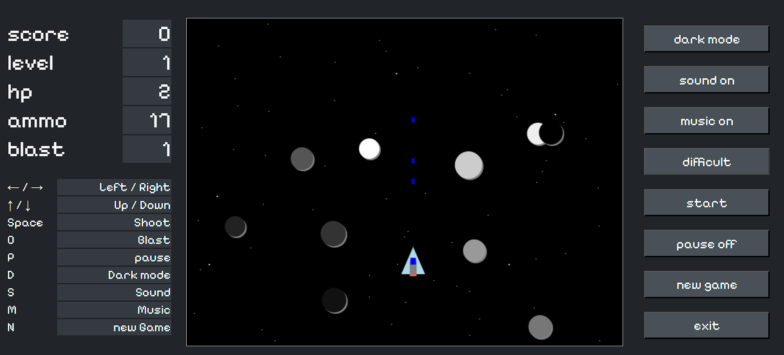
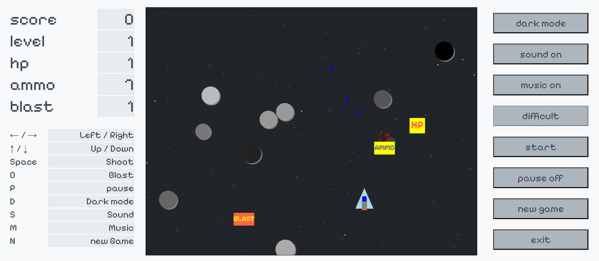

# Space Blast

Space Blast - це гра, створена з використанням HTML5 Canvas та JavaScript. 
Мета гри - управляти космічним кораблем, ухилятися від комет і знищувати астероїди. 
Гра розроблена з увагою до динамічного геймплею та плавної анімації.

## Скриншот гри




## Вимоги до системи

- Браузер з підтримкою HTML5 (Chrome, Firefox, Edge, Safari)
- JavaScript увімкнено
- Для розробки: Node.js та npm (якщо використовується).

## Встановлення

### 1. Клонування репозиторію

Клонуйте репозиторій на свій комп'ютер за допомогою Git:

```bash
git clone https://github.com/gadiim/Space_Blast.git
```

### 2. Запуск проєкту
Просто відкрийте файл `index.html` у вашому браузері для запуску гри. Якщо використовується сервер для розробки, запустіть його через npm:

```bash
npm start
```

### Використання
- **Керування кораблем**: Використовуйте клавіші зі стрілками для переміщення та пробіл для стрільби.
- **Мета гри**: Уникати астероїдів і знищувати ворогів, набираючи очки.
- **Особливості**: Гра підтримує збереження найкращого результату в локальному сховищі.

### Структура проєкту
- `index.html`: Основний HTML-файл.
- `style.css`: Стилі для гри.
- `main.js`: Основний файл JavaScript для логіки гри.
- `assets/`: Папка з ресурсами (зображення, звуки).

### Ліцензія
Цей проєкт ліцензований за ліцензією MIT. Для отримання додаткової інформації перегляньте файл [LICENSE](LICENSE).

### Автори
- **gadiim** - Розробник гри


